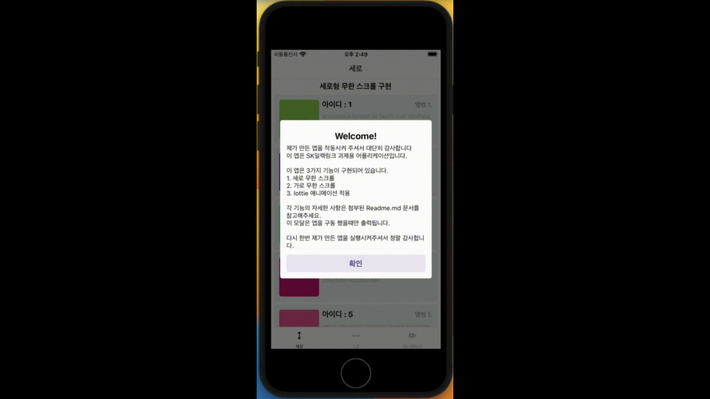

<h1 align='center'>Result Document</h1>

이 과제는 [무료 API](https://jsonplaceholder.typicode.com/photos) 를 활용하여 만들었습니다.

### 어플리케이션 버전 정보
- react-native 0.72.1
- typescript 4.8.4

### 파일 구조
적절한 파일 구조를 형성하여 구체적인 개발 편의를 도모했습니다. 
[자세히 보기](./fileTree.md)

### 화면 구성
이 앱은 3가지 탭(화면)으로 구성되어 있습니다.
1. [세로 무한 스크롤](./vertical.md)
2. [가로 무한 스크롤](./horizon.md)
3. [lottie 애니메이션](./animation.md)

### 상태관리 (Mobx)
Mobx를 사용하여 데이터 핸들링 및 상태관리는 적용했습니다. 
[자세히 보기](./mobx.md)

### 디자인 패턴
Atomic Design Pattern 을 도입하여 컴포넌트간의 재사용성을 극대화했습니다. 
[자세히 보기](./designPattern.md)

### 반응형 뷰 어플리케이션
어떤 기종에서 켜더라도 자동으로 화면에 맞춰지도록 개발했습니다. 
[자세히 보기](./responsive.md)

### 비즈니스 로직의 분리
데이터를 다루는 로직을 따로 분리하여 뷰 로직과 혼용을 방지했습니다. 
[자세히 보기](./excludeBusiness.md)

### 스타일 컴포넌트
CSS-in-JS 로 스타일을 정의했습니다. 
[자세히 보기](./styleComponent.md)

### 사용한 라이브러리
##### 네비게이션 (바텀 탭)
- react-navigation/native
- react-navigation/bottom-tabs
- react-native-safe-area-context
- react-native-screens

##### 상태관리
- mobx
- mobx-react

##### 비동기 통신
- axios

##### 애니메이션
- lottie-react-native

##### 이미지
- react-native-fast-image

##### 스타일 컴포넌트
- styled-component

##### 기타 (안정된 화면을 위한)
- react-native-iphone-x-helper