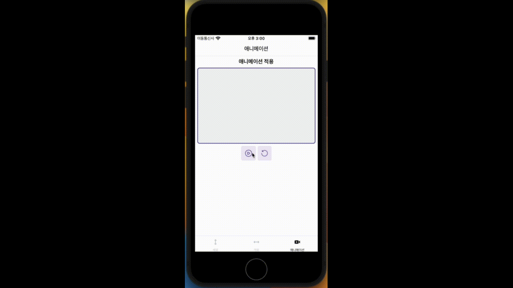

<h1 align='center'>애니메이션</h1>

애니메이션은 lottie-react-native 라이브러리를 사용하여 임의로 3번째 탭에 애니메이션 기능을 추가했습니다.

[코드 보기](../pages/action/index.tsx)

#### 애니메이션 재생, 일시정지, 다시 재생

특별히 애니메이션을 어디에 어떻게 적용하라는 말이 없어서 임의로 개발했습니다.

애니메이션이 재생, 일시정지, 다시 재생 기능을 임의로 개발했습니다.
