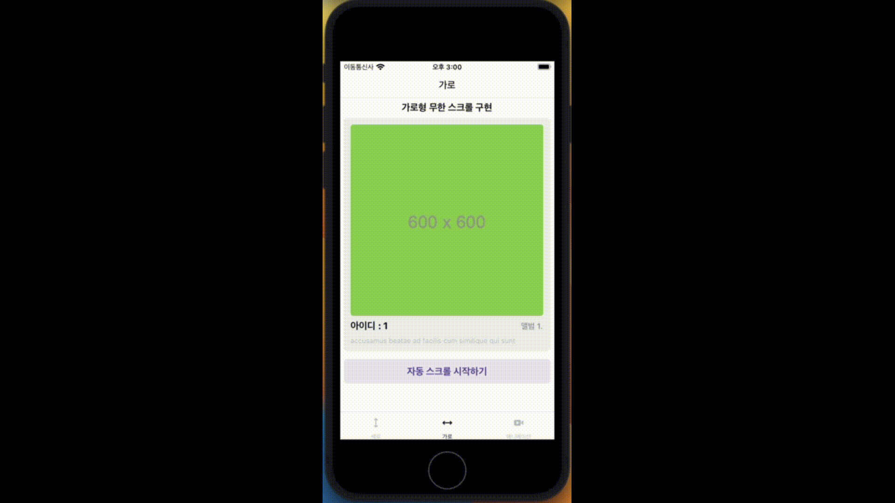

<h1 align='center'>가로 무한 스크롤</h1>

무한 스크롤을 구현하라는 것 이외에는 특별히 만들라는 템플릿이 없었기 때문에 이 부분은 그냥 평소에 보던 어플리케이션의 캐러셀과 같이 구현했습니다. 
3초마다 자동으로 가로 카드가 넘어가도록 구현했습니다. 임의로 손으로도 넘길수 있습니다. 
랜더링 효율성을 높이기 위해 FlatList를 사용하여 구현했습니다. 
무한 스크롤을 수행하면서 새로 데이터가 로딩될 때 자연스럽게 계속 데이터가 있던 것 처럼 자연스럽게 api 를 호출하고 우측 로딩바가 보이도록 개발했습니다.

[코드 보기](../pages/horizon/index.tsx)

#### 자동 스크롤
손으로도 카드를 넘길 수 있지만, 3초마다 자동으로 카드가 우측으로 넘어갑니다. 
자동 넘기는 과정이 불편하다면 스크롤 정지 기능을 추가해 넣어 두었습니다.  

[useDebounce](./../hooks/useDebounce.ts) 커스텀 훅을 구현하여 3초마다 자동으로 넘어가도록 개발했습니다.

#### 무한으로 우측 스크롤
랜더링의 최하단에 도달하여 더 이상 데이터가 없는 경우 서버에서 새로운 데이터를 불러와 다시 화면에 표시합니다. 
끝 지점에 도달할 경우, 최하단의 로딩바가 돌아가면서 새로운 데이터를 불러옵니다. 
가로 무한 스크롤의 경우 끝지점에서 스크롤이 실패하는 에러를 대비하여 다시 요청하는 로직을 추가했습니다.