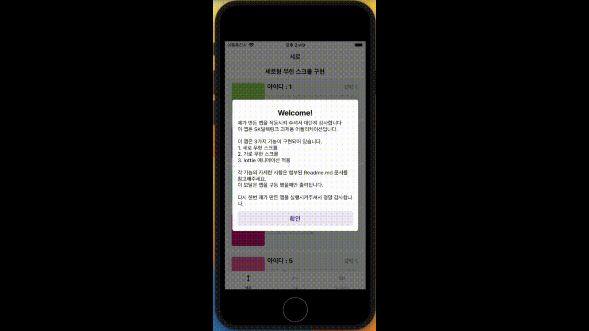

<h1 align='center'>세로 무한 스크롤</h1>

무한 스크롤을 구현하라는 것 이외에는 특별히 만들라는 템플릿이 없었기 때문에 일렉링크 어플리케이션의 추천 충전소를 참고하여 개발했습니다. 
랜더링 효율성을 높이기 위해 FlatList를 사용하여 구현했습니다. 
무한 스크롤을 수행하면서 새로 데이터가 로딩될 때 자연스럽게 계속 데이터가 있던 것 처럼 자연스럽게 api 를 호출하고 하단에 로딩바가 보이도록 개발했습니다. 
보통 스크롤바 최상단을 당기면 새로고침 기능이 있게 개발했었기 때문에 해당 기능도 추가했습니다. 

[코드 보기](../pages/vertical/index.tsx)

#### 당겨서 새로고침 하기

데이터를 다시 불러와야 할 경우 최상단을 쭉 당겨서 다시 불러올 수 있습니다.

최상단에 로딩바가 돌아가면서 새로고침 됩니다.

#### 무한 스크롤

랜더링의 최하단에 도달하여 더 이상 데이터가 없는 경우 서버에서 새로운 데이터를 불러와 다시 화면에 표시합니다.

끝 지점에 도달할 경우, 최하단의 로딩바가 돌아가면서 새로운 데이터를 불러옵니다.
